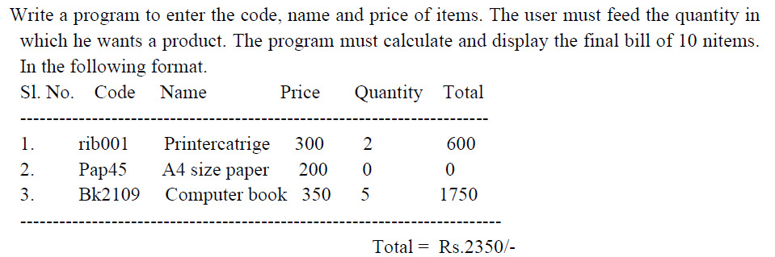
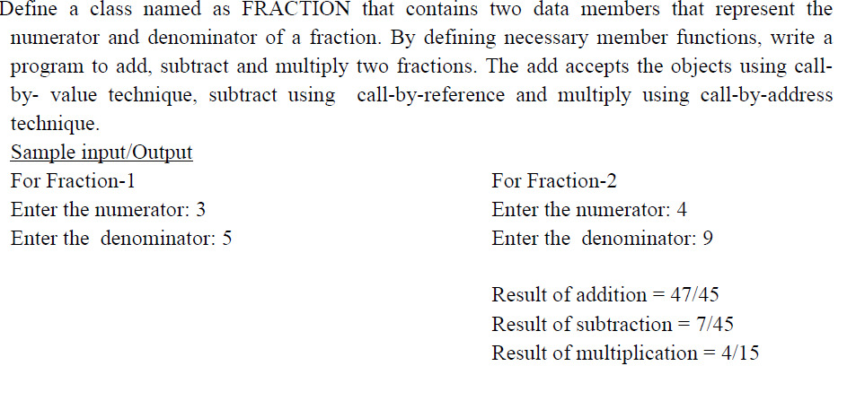
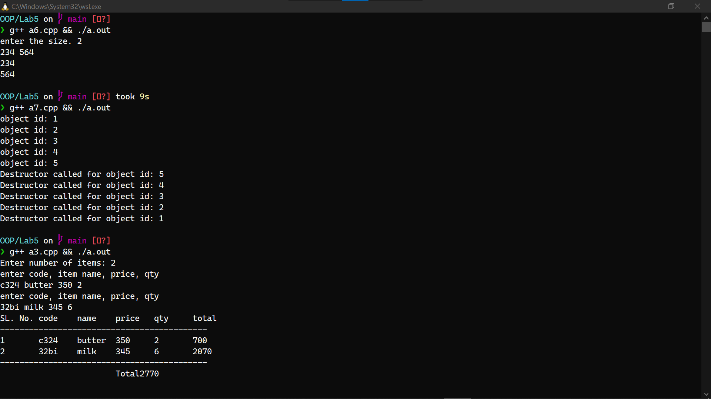
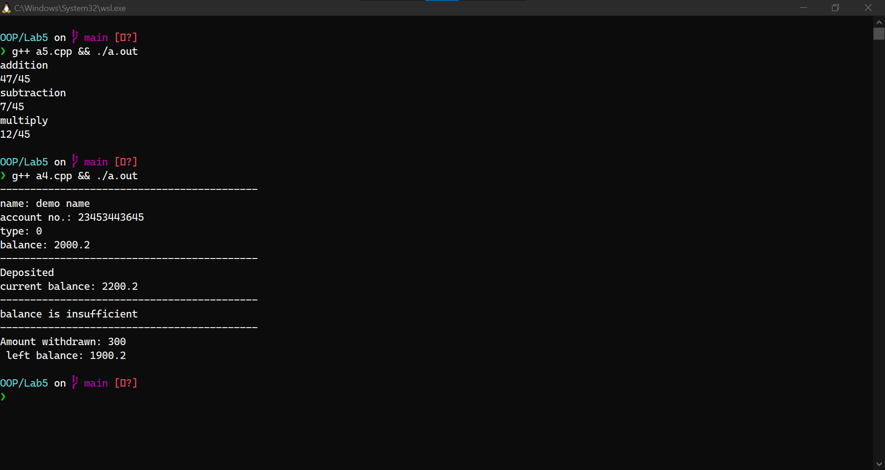

# Lab5
`Date: 1/9/21`

# Questions
1. (Single Inheritance) Write a program to create a class CIRCLE with one field as radius, used to calculate the area of a Circle. Create another class RECTANGLE used to calculate the area of the rectangle which is a subclass of CIRCLE class. Use the concept of single inheritance such that the radius of circle class can be re-used as length in rectangle class. Take necessary data members and member functions for both the classes to solve this problem. All the data members are initialized through the constructors. Show the result by accessing the area method of both the classes through the objects of rectangle class.✅
2. Create a class student which stores name, roll number and age of a student. Derive a class
test from student class, which stores marks in 5 subjects. Input and display the details of
a student.✅
3.  ✅
4.  ✅
5.  ✅

# O/P

