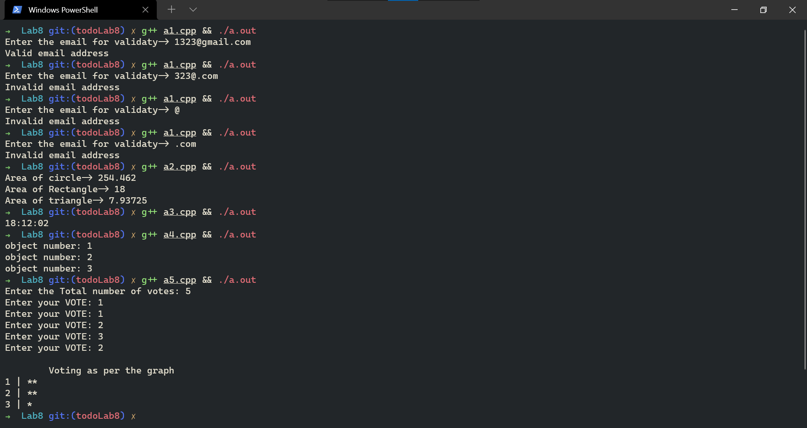
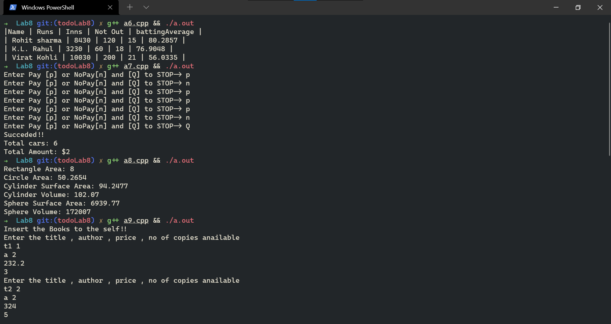
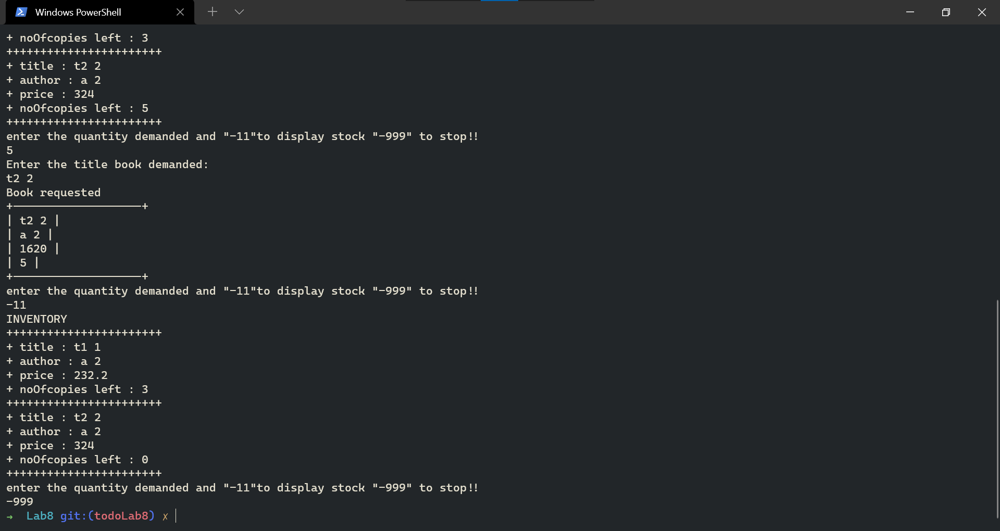

# Lab 8

# questions
* WAP to design a class Validate_Email which contains a static data member "email_address" and static member function "check()" to validate given email_address is valid or not if the "email_address violates any of the following conditions then a message should be displayed as "invalid email address"
    i) it must have '@' symbol in the middle of the string'
    ii) the string must be terminated with ".com"✅
* WAP to find the area of a circle rectangle triangle with the help of function overloading✅
*  What is the importance of static data member and static member function
in C++? Write down their characteristics. Write a program to count the number of
objects created in a class with the help of static data member and member
function. ✅
* create a class TIME with data members hour, minute and second and a constructor to initialize the data member WAP to adds 2 time objects the objects must be passed as function arguments design separate function whatevernecessary finally result should be displayed in hh:mm:ss format✅
* an election is contested by 3 candidates and the candidates are numbered from 1 to 3 
the voting is done by making the candidate number on the ballot paper WAP using constructor and destructor to 
i) cast the vote for user supplied n votes
ii) read the ballots and count the votes for each candidates✅

* table is given 

    Name | Runs | Innings | times not out
    --|--|--|--
    KL Rahul | 3230 | 60 | 18
    Rohit sharma | 8430 | 120 | 15
    .. | .. | .. | ..

    WAP using parametrized constructor to 
    i. read the figures
    ii. calculate the batting average
    iii. print the complete table in the descending order of the average by including average✅

* Imagine a tollbooth at a bridge. Cars passing by the booth are expected to pay a 50 cent toll. Mostly they do, but sometimes a car goes by without paying. The tollbooth keeps track of the number of cars that have gone by, and of the total amount of money collected. Model this tollbooth with a class called TollBooth. The two data items are a type unsigned int to hold the total number of cars, and a type double to hold the total amount of money collected. A constructor initializes both of these to 0. A member function called payingCar() increments the car total and adds 0.50 to the cash total. Another function, called nopayCar(), increments the car total but adds nothing to the cash total. Finally, a member function called display() to show the two totals. Include a
supporting class to test this class.✅
* Create a class Shape derive classes named "Dimension2" and "Dimension3" from "Shape" class. derive 2 classes namely "rectangle" and "circle" from class "dimension2" derive 2 classes namely "cylinder" and "sphere" from class "Dimensio3" include the data members and function in the revelant classes to find area of a rectangle and a circle also surface area and volume of a cylinder and a sphere
    area of rectangle = l*b        area circle = pi * r^2
    area of cylinder = pi * r^2 * h      volume of sphere = 4/3 * pi * r^3
    surface area of cylinder= 2pi * rh + 2pir^2      Surfece area of sphere = 4pi r^2✅
* WAP a menudriven program that reads title of a book from the user the program will check if the book is avilable or not if available then display the details of the booksuch as author, price and number of copies available calculate the bill of the user as per the number of copies required decrement the count of books requested from available copies the program must slo have functions to have functions to update the number of copies and the price of the book✅

# O/P

