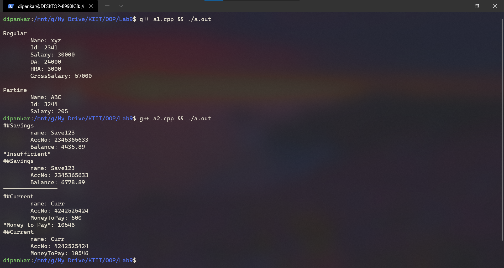
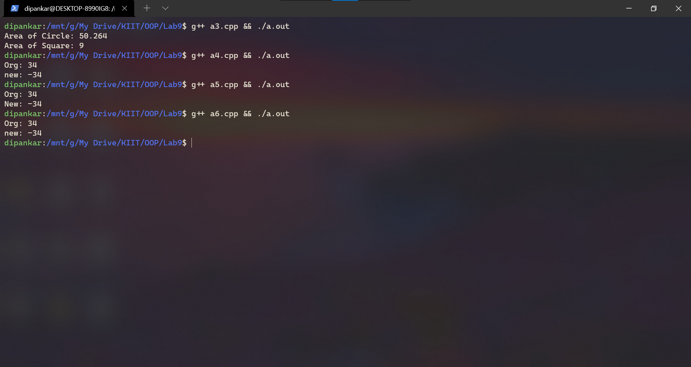

# Lab9

`Date: 27-10-21`

# questions
1. Create a class which stores employee name, id and salary Derive two classes from
‘Employee’ class: ‘Regular’ and ‘Part-Time’. The ‘Regular’ class stores DA, HRA and
basic salary. The ‘Part-Time’ class stores the number of hours and pay per hour.
Calculate the salary of a regular employee and a part-time – use the concept of
virtual function✅
2. Create a class Acount which stores account number, customer name and balance.
Derive two classes from ‘Account’ class: ‘Savings’ and ‘Current’. The ‘Savings’ class
stores minimum balance. The ‘Current’ class stores the over-due amount. Include
member functions in the appropriate class for
-deposit money
-withdraw [For saving account minimum balance should be checked.]
[For current account overdue amount should be calculated.]
-display balance
Display data from each class using virtual function.✅
3. Create a class shape. Derive two classes from it; Circle and Square. Find the area of
each shape and display it. Shape class should be abstract base class. Use the concept of
pure virtual function.✅
4. WAP in C++ which will overload the unary – operator using a member function.✅
5. WAP in C++ which will overload the unary – operator using member function with
returning an object.✅
6. WAP in C++ which will overload the unary – operator using friend function.✅

# O/P

